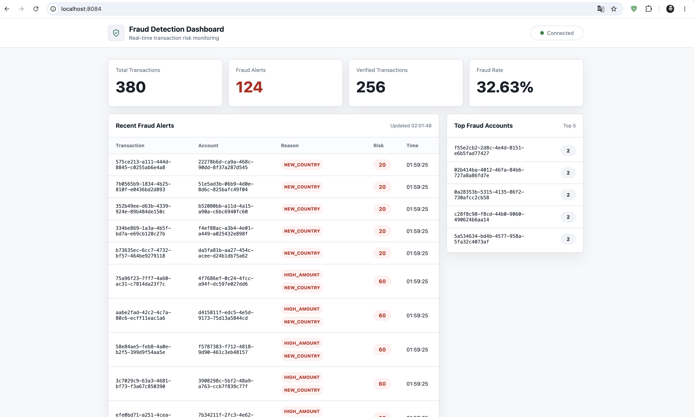

# Real-Time Fraud Detection System



I built this project to practice event-driven microservices in a realistic Spring Boot system.
The main goal is to study Kafka as an inter-service event bus, understand asynchronous
communication between services, and see how ClickHouse can be used in practice as an
analytics/read-model database for dashboard queries.

The system models a real-time fraud detection flow: payments are created in one service,
published to Kafka, analyzed by a fraud service, sent to notification consumers, and projected
into ClickHouse for live dashboard statistics.

## Local Development

The easiest local setup is:

1. Start infrastructure with Docker Compose.
2. Run Java services from IntelliJ IDEA or Maven.
3. Open Kafka UI and the dashboard in a browser.

Important: `./run.sh infra-up` starts only infrastructure containers. It does not start
Spring Boot services. `http://localhost:8084` works only after `dashboard-service` is running.

### Prerequisites

- Java 21+
- Maven 3.9+
- Docker Desktop

### Start Infrastructure

```bash
./run.sh infra-up
```

Local ports and credentials are stored in `.env`. Use `.env.example` as a clean template.

This starts:

| Service | Local URL / Port |
| --- | --- |
| Kafka | `localhost:9092` |
| Kafka UI | `http://localhost:8090` |
| Payment PostgreSQL | `localhost:5432/payment_db` |
| Fraud PostgreSQL | `localhost:5433/fraud_db` |
| Notification PostgreSQL | `localhost:5434/notification_db` |
| ClickHouse | `http://localhost:8123/dashboard_db` |

Kafka topics are created automatically by the `kafka-topics-init` container:

```text
transactions.raw
transactions.verified
transactions.fraud
transactions.dead-letter
notifications.outbox
```

Check container status:

```bash
./run.sh infra-ps
```

Follow logs:

```bash
./run.sh infra-logs
```

Stop infrastructure:

```bash
./run.sh infra-down
```

Reset all local Docker data:

```bash
./run.sh infra-reset
```

### Run Services Locally

Run each service in a separate terminal:

```bash
./run.sh payment
./run.sh fraud
./run.sh notification
./run.sh dashboard
```

Service ports:

| Service | Port | Health |
| --- | --- | --- |
| payment-service | `8081` | `http://localhost:8081/actuator/health` |
| fraud-analyzer-service | `8082` | `http://localhost:8082/actuator/health` |
| notification-service | `8083` | `http://localhost:8083/actuator/health` |
| dashboard-service | `8084` | `http://localhost:8084/actuator/health` |

For dashboard UI-only preview without Kafka listeners:

```bash
./run.sh dashboard-ui
```

Or start it in the background:

```bash
./run.sh dashboard-ui-start
./run.sh dashboard-ui-status
./run.sh dashboard-ui-stop
```

Then open:

```text
http://localhost:8084
```

If Chrome shows `ERR_CONNECTION_REFUSED` for `localhost:8084`, the dashboard service is not
running yet. Start it with `./run.sh dashboard` for the full Kafka flow or `./run.sh dashboard-ui`
for UI-only preview.

### Generate Demo Transactions

After infrastructure and services are running, generate mixed verified and fraud traffic:

```bash
./run.sh demo-transactions
```

To see live dashboard updates, run the full dashboard service with `./run.sh dashboard`.
The `dashboard-ui` mode is only a UI preview and starts Kafka listeners disabled.

The script sends 190 `POST /api/transactions` requests through `payment-service`.
It includes verified payments, single-rule fraud, and combined-rule fraud scenarios:
`HIGH_AMOUNT`, `NEW_COUNTRY`, `HIGH_FREQUENCY`, `HIGH_AMOUNT + NEW_COUNTRY`,
`HIGH_AMOUNT + HIGH_FREQUENCY`, and `HIGH_FREQUENCY + NEW_COUNTRY`.

`NIGHT_TIME` depends on the current UTC hour because `payment-service` creates the event timestamp
itself. The night candidates become fraud only when the script runs during UTC `00:00..05:59`.

To preview generated requests without sending them:

```bash
DRY_RUN=true REQUEST_DELAY_SECONDS=0 PROCESSING_WAIT_SECONDS=0 ./run.sh demo-transactions
```

### Compile

```bash
./run.sh compile
```

### Useful URLs

| Tool | URL |
| --- | --- |
| Kafka UI | `http://localhost:8090` |
| Dashboard UI | `http://localhost:8084` |
| Payment Swagger | `http://localhost:8081/swagger-ui.html` |
| Fraud Swagger | `http://localhost:8082/swagger-ui.html` |
| Notification Swagger | `http://localhost:8083/swagger-ui.html` |
| Dashboard Swagger | `http://localhost:8084/swagger-ui.html` |

## Local Flow

```text
payment-service
  -> transactions.raw
  -> fraud-analyzer-service
  -> transactions.verified / transactions.fraud
  -> notification-service
  -> dashboard-service
  -> ClickHouse dashboard read model
```

For local development, PostgreSQL and Kafka are infrastructure dependencies. Spring Boot services run on the host and connect to infrastructure through `localhost` ports.
